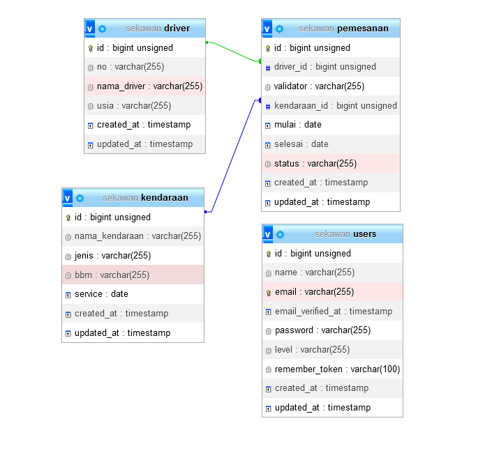
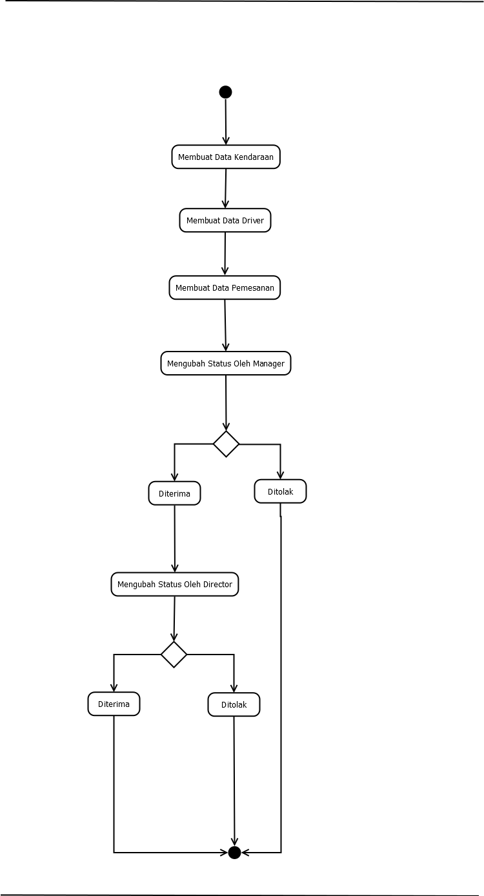

<p align="center"><a href="https://laravel.com" target="_blank"></a></p>

<p align="center">
<a href="https://github.com/laravel/framework/actions"></a>
<a href="https://packagist.org/packages/laravel/framework"></a>
<a href="https://packagist.org/packages/laravel/framework"></a>
<a href="https://packagist.org/packages/laravel/framework"></a>
</p>

## Email & Password 

Saya menggunakan seeder pada sistem ini untuk memudahkan pengguna saat melakukan login. Untuk menjalankan seeder yang sudah dibuat anda dapat menggunakan perintah

```
php artisan db:seed
```

Kemudian untuk dapat melakukan login anda dapat menggunakan email dan password berikut
```
email : admin@email.com
pass  : admin123

email : manager@email.com
pass  : manager123

email : director@email.com
pass  : director123

```

## Information
```
Mysql version : 8.0.30
PHP version : 8.3.4
Framework : Laravel, Tailwind
```





## Guide
A. Admin
1. Login sebagai admin
2. Input data kendaraaan melalui halaman "Kendaraan" dan tekan tombol plus, jika data sudah terisi klik simpan
3. Input data driver melalui halaman "Driver" dan tekan tombol plus, jika data sudah terisi klik simpan
4. Input data pemesanan melalui halaman "Pemesanan" dan tekan tombol plus, jika data sudah terisi klik simpan

B. Manager
1. Login sebagai manager
2. Masuk ke halaman "Pemesanan", klik tombol "Lihat" kemudian rubah status yang awalnya "Diajukan" menjadi "Terima" atau "Tolak"

C. Director
1. Login sebagai director
2. Masuk ke halaman "Pemesanan", klik tombol "Lihat" kemudian rubah status yang awalnya "Diajukan" menjadi "Terima" atau "Tolak"